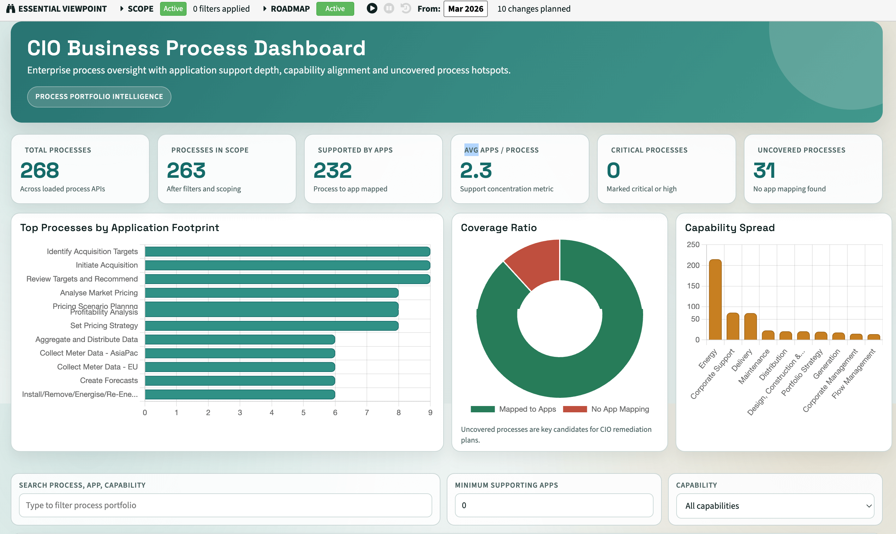

# Essential View Builder MCP



This MCP (Model Context Protocol) server provides tools and resources for building high-quality Essential Viewer views (XSL dashboards and reports) using validated v2.0 patterns.

The server is fully self-contained — all documentation, templates, and Essential Viewer source files are bundled inside the Docker image. No Python installation is required.

## Features

- **Scaffold Generation**: Generate complete, working XSL view templates following v2.0 patterns.
- **API Guidance**: Dynamically analyse available Essential APIs to suggest property names and structures.
- **Golden Patterns**: Enforce best practices (async/await, no CDATA, correct ampersand encoding).
- **Consolidated Resources**: All required documentation and templates are bundled with the server.
- **Essential Viewer Reference**: Browse and read the full Essential Viewer source tree from within the MCP.

## Tools

| Tool | Description |
|---|---|
| `generate_view_scaffold` | Creates a full XSL view file based on selected APIs and view type |
| `generate_api_scaffold` | Generates an Essential API (XSLT) following the Golden Pattern |
| `suggest_view_architecture` | Analyses a description and recommends APIs and property mappings |
| `adapt_external_view` | Ports an external HTML/JS demo into an Essential-ready XSL view |
| `read_viewer_file` | Reads any XSL file from the bundled Essential Viewer source tree |
| `escape_xsl_content` | Correctly encodes JavaScript for XSL inclusion |
| `wrap_in_cdata` | Wraps content in a CDATA section (use sparingly — v2.0 pattern prefers XML encoding) |

## Resources

| URI | Description |
|---|---|
| `essential-view://api-docs` | Catalogue of all Essential Viewer APIs with property structures |
| `essential-view://viewer-index` | Index of all ~686 XSL files in the Essential Viewer, grouped by domain |
| `essential-view://view-build-docs` | Complete guide to building v2.0 views |
| `essential-view://quick-reference` | One-page pattern reference card |
| `essential-view://deprecated-patterns` | Critical warnings about forbidden patterns |
| `essential-view://view-template` | Base XSL fetcher template |
| `essential-view://handlebars-functions` | Common Handlebars helpers |
| `essential-view://api-property-verification` | Guide for verifying API property names before use |

---

## Quick Start (Docker — Recommended)

### 1. Build the image

```bash
docker build -t eas/essential-view-builder-mcp:v1 .
```

### 2. Run the container (optional — verify the build works)

```bash
docker run -d --name essential-view-builder-mcp eas/essential-view-builder-mcp:v1
```

The `-d` flag runs the container in the background. Check it started cleanly with:

```bash
docker logs essential-view-builder-mcp
```

Stop and remove it when done:

```bash
docker stop essential-view-builder-mcp && docker rm essential-view-builder-mcp
```

> **Note:** When used as an MCP server, the AI client spawns the container itself via `docker run -i` (stdio transport). You do not need to keep a container running manually.

### 3. Configure your AI client

Pick the section below for your client. All configurations use the same Docker command:

```
docker run -i --rm --name essential-view-builder-mcp eas/essential-view-builder-mcp:v1
```

---

## Client Setup Guides

### Cursor

Add or create `~/.cursor/mcp.json` (applies to all projects):

```json
{
  "mcpServers": {
    "essential-view-builder": {
      "command": "docker",
      "args": ["run", "-i", "--rm", "--name", "essential-view-builder-mcp", "eas/essential-view-builder-mcp:v1"]
    }
  }
}
```

Alternatively, create `.cursor/mcp.json` inside a specific project folder to scope it to that workspace.

Restart Cursor after saving. The server will appear under **Settings → MCP**.

---

### Visual Studio Code (with GitHub Copilot or Continue)

**GitHub Copilot (VS Code 1.99+)**

Add to your VS Code `settings.json` (`Cmd+Shift+P` → *Open User Settings JSON*):

```json
{
  "mcp": {
    "servers": {
      "essential-view-builder": {
        "type": "stdio",
        "command": "docker",
        "args": ["run", "-i", "--rm", "--name", "essential-view-builder-mcp", "eas/essential-view-builder-mcp:v1"]
      }
    }
  }
}
```

Or add a `.vscode/mcp.json` file at the workspace root for project-scoped configuration:

```json
{
  "servers": {
    "essential-view-builder": {
      "type": "stdio",
      "command": "docker",
      "args": ["run", "-i", "--rm", "--name", "essential-view-builder-mcp", "eas/essential-view-builder-mcp:v1"]
    }
  }
}
```

**Continue extension**

Add to `~/.continue/config.json` under `mcpServers`:

```json
{
  "mcpServers": [
    {
      "name": "essential-view-builder",
      "command": "docker",
      "args": ["run", "-i", "--rm", "--name", "essential-view-builder-mcp", "eas/essential-view-builder-mcp:v1"]
    }
  ]
}
```

---

### Claude Desktop

Open your Claude Desktop config file:
- **macOS**: `~/Library/Application Support/Claude/claude_desktop_config.json`
- **Windows**: `%APPDATA%\Claude\claude_desktop_config.json`

Add the server entry:

```json
{
  "mcpServers": {
    "essential-view-builder": {
      "command": "docker",
      "args": ["run", "-i", "--rm", "--name", "essential-view-builder-mcp", "eas/essential-view-builder-mcp:v1"]
    }
  }
}
```

Restart Claude Desktop. The server will appear as a connected integration.

---

### ChatGPT (via OpenAI Desktop App)

The OpenAI desktop app supports local MCP servers. Open **Settings → Connected tools → Add tool** and choose *Local server (stdio)*.

Set the command to `docker` and the arguments to:

```
run -i --rm --name essential-view-builder-mcp eas/essential-view-builder-mcp:v1
```

Or if you prefer a config file approach, add to `~/Library/Application Support/OpenAI/mcp.json` (macOS):

```json
{
  "mcpServers": {
    "essential-view-builder": {
      "command": "docker",
      "args": ["run", "-i", "--rm", "--name", "essential-view-builder-mcp", "eas/essential-view-builder-mcp:v1"]
    }
  }
}
```

Restart the app after saving.

---

## Generated Output

By convention, views generated by this MCP are saved to an `output/` directory at the project root. This folder is excluded from version control via `.gitignore`.

---

## Alternative: Python (without Docker)

If you cannot use Docker, you can run the server directly with Python 3.11+.

**Requirements**: Python 3.11 with the packages listed in `requirements.txt`.

```bash
# macOS with Homebrew
brew install python@3.11
/usr/local/bin/python3.11 -m pip install -r requirements.txt

# Run setup verification
bash setup.sh
```

Then replace the `command`/`args` in any of the client configs above with:

```json
"command": "python3",
"args": ["/path/to/essential-view-builder-mcp/server.py"]
```

---

## Using the MCP

You can now create your own EA tool based on your own requirements. We've developed a view builder MCP that can take the essential structures and use the dataset APIs to create views for you.

We’ve tested with Open AI 5.3+, Gemini 3 Flash+, Sonnet 4.5+ and it works fine.  Other models may behave differently.  The thinking models perform the best

### Installation:

**Steps**

1.  Load up the MCP in and IDE (CODEX, Visual Studio, AntiGravity, Claude Code) and connect it to your favourite AI tool
    
2.  Describe the view you want to create 
    
3.  let it do its work
    
4.  upload the view to Essential
    
5.  use the view
    

This version can create some quite complex views and works best with data in the predefined data set APIs we provide.

Sample prompts:

**Method 1 – Ask the AI to create the view**

“Create me an interactive application dashboard for the CIO”

“Create me an interactive application dashboard for the CIO, with pie charts for disposition and lifecycle status and small cards summarising the total applications”

“Create a timeline chart for strategic plans with the impacted elements in a pop-up”

**Method 2 – Provide a working HTML/JS version and reverse in the data**

You can also work with the AI to create a static HTML/JS version of the view you want and then provide that code to the MCP and say, 

“make this work with Essential Data”

**Method 3 – Ask for a JSON structure then create the view.**

1.  “Create me a JSON structure from the essential dataAPIs to allows me to see applications with lifecycles mapped to business capabilities.” 
    
2.  Once the JSON structure looks OK, say “Use this JSON structure to create an application by capability view with counts by lifecycle status”
    

This uses the current data setAPI's, if you have given access to your AI to the essential GitHub repository then it may try and create new queries to get any data that isn't available currently via the data set API's.

The AI should create and XSL file which you should put in your user folder:

**Cloud/Docker: Configure > System Administration > View Management** and upload to the viewer you are using

**Open Source**: put the file in your user folder

You can test the view quickly without creating a report instance by just changing the URL to. \[YOUR TENANT or Localhost URL\]/reportXML.xml&**XSL=user/\[YOUR FILE NAME\]**

Once you are happy, create a report instance in the repository, set the XSL path to **user/\[YOUR FILE NAME\],** take a screenshot and save as png/jpg and put that in the image folder.  Point the image path to the images folder.

**Potential Issues**

Sometimes the AI doesn’t use the MCP:

1.  Check it can see the MCP – ask ‘ What resources can you see’ and it should list the resources
    
2.  Add, ‘You must use the Essential View Builder MCP’ to your prompt
    

It may error from time to time.  Just copy the errors you see in the browser into your AI and ask it to fix them. 

A common error is the use of unescaped characters in the XSL the MCP has the resources is to avoid this but the AI doesn't always obey.  We tend to mix the XML and JS into the same file, you don’t have to but it is a little easier to manage and test, and the MCP will use this pattern.  If you have &, < or <= in the JS and it isn’t escaped then the view will fail.  Just paste the error message back into the AI and it will fix it, or you can manually search and replace with &amp; (&),  &lt; (<) of &lt;=. (<=) .

If you request data that isn't in the data API's or in the repository then typically the AI will leave placeholders

It may not return the data expected as it may not use APIs even though they exist.  So tell it to use specific Dataset APIs if it is missing data, e.g. Projects and plans

It may use instance ID sometimes rather than names, just tell it  ‘use the names not the IDs’

Any questions then raise them on the forum.

Cloud users should keep an eye out for our Essential MCP being release, as that, combined with our view builder MCP, takes this to another level as it will write new queries.

---

Built for Essential Project.
